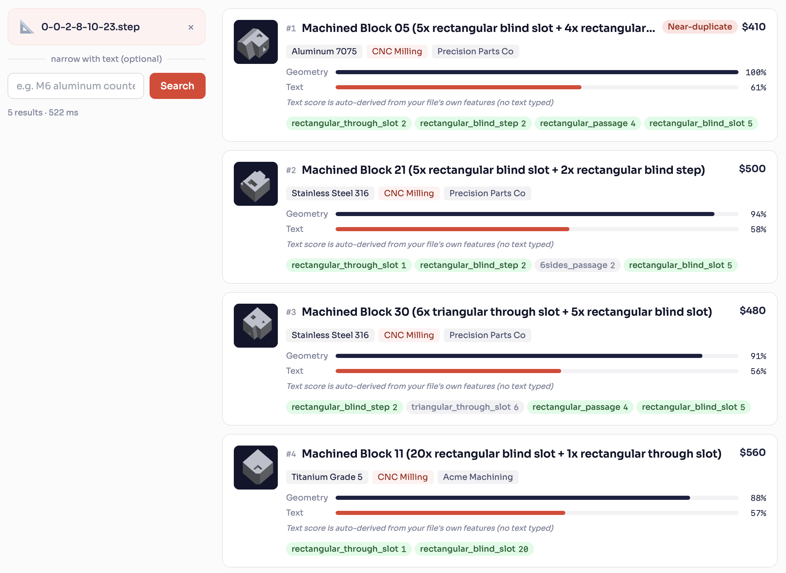
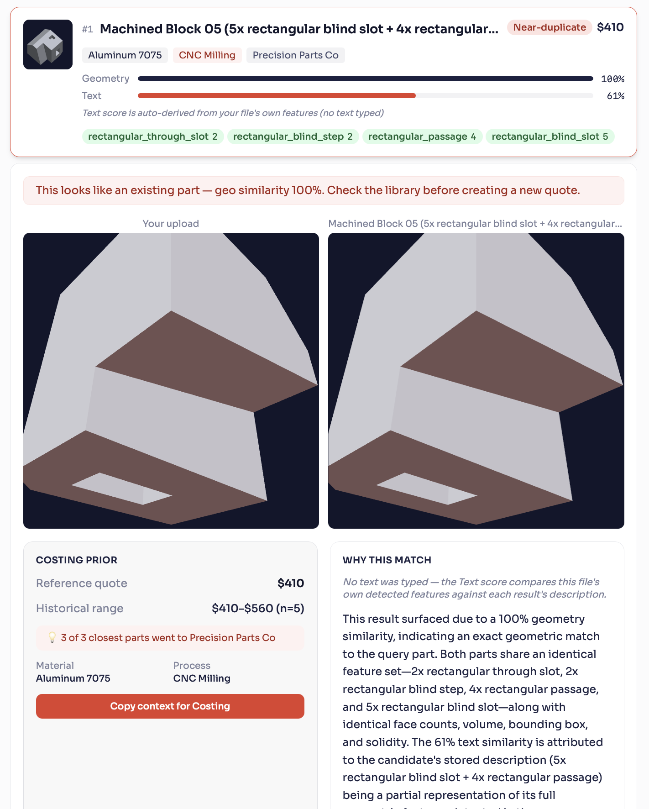
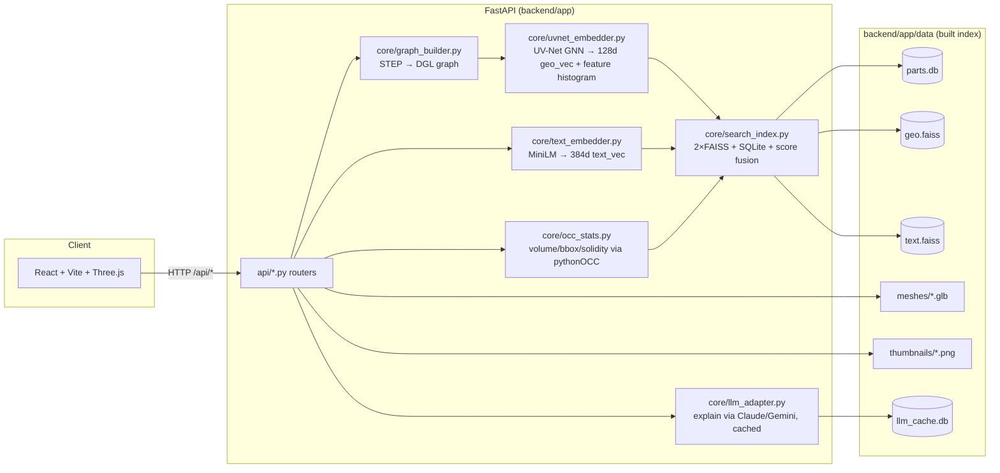
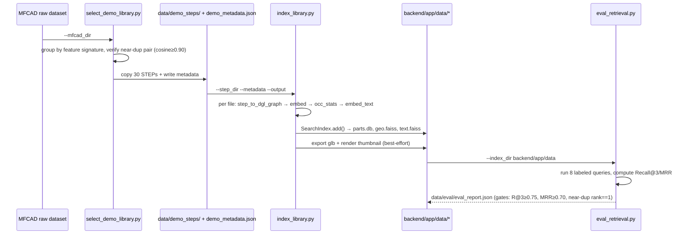
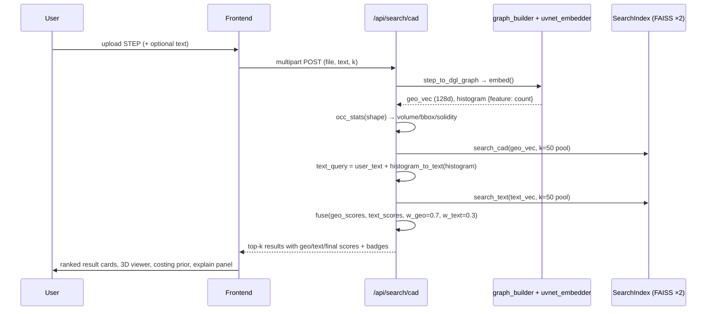
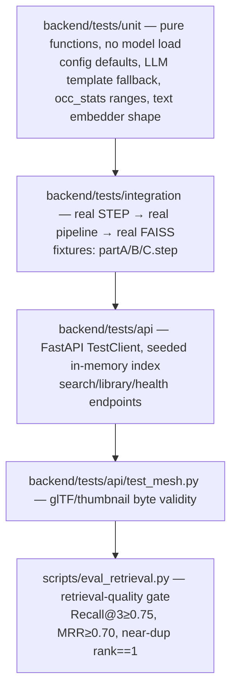

# cad-search-agent

Engineering search for CAD: upload a STEP CAD file and/or type text → get ranked similar past
parts with geometry + text match scores, machining feature overlap, cost/supplier history, and an
LLM "why this matched" explanation.
```
(Inspired from UV-net, cad-feature-detection(pythonOCC+ DGL) & Palmetto(Efficient rendering))

UV-Net:
Curve 1D CNN
       +
Surface 2D CNN
       ↓
Graph message passing
       ↓
      MLP
```
---

## Screenshots

| Search results | 3D viewer + explain panel |
|---|---|
|  |  |


---

## Setup (macOS)

Two install paths. Start with the **quick path** — it's enough to run the app against the
pre-built index already shipped in `backend/app/data/`. You only need the **full path** if you're
re-indexing new STEP files (touches pythonOCC/DGL/UV-Net).

### Quick path — run the app, no re-indexing

```bash
# Backend
cd backend
python3.11 -m venv .venv
source .venv/bin/activate
pip install -r requirements.txt

# Frontend
cd ../frontend
npm install
```

### Full path — adds STEP re-indexing (pythonOCC + DGL + UV-Net)

pythonOCC and DGL don't reliably install via pip on Apple Silicon — use conda for pythonOCC, pip
for the rest:

```bash
brew install --cask miniconda   # if you don't have conda already

conda create -n cad-search python=3.11 pythonocc-core=7.7.2 -c conda-forge
conda activate cad-search

cd backend
pip install -r requirements.txt
pip install "lightning==2.1.3"
pip install "dgl==1.1.3" -f https://data.dgl.ai/wheels/repo.html
pip install "pydeprecate==0.3.2"   # occwl checkpoint compat, NOT `deprecate`
pip install -r requirements-ml.txt
```

Notes:
- `pythonocc-core` must stay pinned at `7.7.2` — 7.8+ removed an API `occwl` depends on.
- Both conda's OCC and pip's torch ship OpenMP — run backend commands with
  `KMP_DUPLICATE_LIB_OK=TRUE` if you hit an OpenMP abort.

### LLM explanations (optional)

Explanations work without this (deterministic template fallback). To enable a real LLM, create
`backend/.env`:

```bash
LLM_PROVIDER=anthropic   # or "gemini", or omit / "none" to disable
LLM_API_KEY=sk-...
```

---

## Run

```bash
# Terminal 1 — backend (from backend/, venv or conda env active)
uvicorn app.main:app --reload --port 8000

# Terminal 2 — frontend
cd frontend
npm run dev
```

Open **http://localhost:5173**. Vite proxies `/api/*` to `http://localhost:8000`.

Sanity check the backend alone: `curl http://localhost:8000/api/health`.

---

## Architecture



Offline indexing (`scripts/index_library.py`) runs the same `graph_builder → uvnet_embedder →
occ_stats → text_embedder → search_index` pipeline over a directory of STEP files to populate
`backend/app/data/`. Query-time (`/api/search/cad`) runs the identical pipeline on one uploaded
file, then searches the pre-built indices.

---

## Stack & key dependencies

| Layer | Tech |
|---|---|
| Backend | FastAPI 0.115, Python 3.11, uvicorn |
| Geometry ML | UV-Net (custom GNN: DGL + PyTorch Lightning), pythonOCC 7.7.2 (via vendored `occwl`) |
| Text embedding | `sentence-transformers` `all-MiniLM-L6-v2` (384-dim) |
| Vector search | `faiss-cpu` `IndexFlatIP` (cosine via L2-normalized vectors), one index each for geo/text |
| Metadata store | SQLite (`parts.db`) |
| LLM | Anthropic (`claude-haiku-4-5-20251001`) or Gemini (`gemini-2.5-flash`), optional, `LLM_PROVIDER=none` by default |
| Frontend | React 18 + Vite 6 + TypeScript, Tailwind, `@react-three/fiber` + `three` for the glTF viewer |
| Thumbnails | Custom NumPy z-buffer software rasterizer (no GPU/window-server — see `core/thumbnail.py` header comment) |

`backend/requirements.txt` = base web/search deps (CI-friendly, no OCC/DGL).
`backend/requirements-ml.txt` = heavy ML deps (torch, trimesh, google-generativeai) — installed
separately; pythonOCC/DGL/lightning must come from conda (see comments in that file, Apple
Silicon-specific pins).

---

## Dataset

- **Source**: MFCAD dataset (machined prismatic parts), filtered by `scripts/select_demo_library.py`.
- **`data/demo_steps/`** — 30 STEP files, filenames encode a feature-type signature
  (`prefix-instance-classid`); files sharing everything but the instance digit are natural
  near-duplicates.
- **`data/demo_metadata.json`** — 30 entries, one per STEP file:
  ```json
  {
    "filename": "0-0-0-10-10-23.step",
    "name": "Machined Block 01 (10x rectangular blind slot + 3x rectangular through slot)",
    "material": "Aluminum 7075", "process": "CNC Milling", "cost": 530,
    "supplier": "Precision Parts Co", "notes": "...", "known_issues": "", "ppap_notes": ""
  }
  ```
  Auto-generated: material/process/supplier/cost/known-issue are deterministically hashed from
  the filename so results are reproducible.
- **`data/eval/eval_labels.json`** — 8 hand-labeled queries (`type: "cad"|"text"`) with expected
  `relevant_names`, used as the retrieval-quality gate. One entry is the verified near-duplicate
  pair (cosine ≥ 0.90).
- **`data/eval/eval_report.json`** — last run's output: `mrr: 0.854` (1/(actual_rank) for the expected first), `recall_at_3: 1.0`,
  `queries_passing: 8/8`, `near_dup_rank_1: true`.
- **Built index** (`backend/app/data/`): `parts.db` (30 rows), `geo.faiss` + `text.faiss` (30
  vectors each, 128d/384d), `meshes/*.glb` + `thumbnails/*.png` (30 each), `llm_cache.db`.

---

## Building the index (0 → 1)



Commands, in order:
```bash
python scripts/select_demo_library.py --mfcad_dir /path/to/mfcad/step \
  --out_dir data/demo_steps --meta_out data/demo_metadata.json --n 30

python scripts/index_library.py \
  --step_dir data/demo_steps --metadata data/demo_metadata.json \
  --output backend/app/data

python scripts/eval_retrieval.py --index_dir backend/app/data
# exits non-zero if Recall@3 < 0.75, MRR < 0.70, or near-dup not rank 1
```
The repo already ships a built index under `backend/app/data/`, so running the server doesn't
require re-indexing — only needed when adding/changing the source library.

---

## Query-time flow (`POST /api/search/cad`)



**Fusion pool trick**: geo and text are each searched over a pool of `min(index_size, max(k,50))`
candidates (not just `k`) before fusing — otherwise a part absent from one modality's top-k would
wrongly default to a fusion score of 0 instead of its real score.

**Score fusion** (`core/search_index.py::fuse`): `final = 0.7*geo_cosine + 0.3*text_cosine`
(weights configurable). Badges: `near-duplicate` if `geo_score ≥ 0.95`; `weak-match` if
`final_score < 0.55`.

**Auto text signal**: if the user types nothing, the query's own detected feature histogram
(e.g. `"3x rectangular through slot"`) is used as the text query — so geometry-only uploads still
get a real text score, tagged `text_source: "auto_histogram"` so the LLM/UI never claims a
comparison that didn't happen.

---

## API endpoints

All prefixed `/api`. FastAPI app defined in `backend/app/main.py`; CORS allows `CORS_ORIGINS`
(default `http://localhost:5173`).

| Method | Path | Body / Params | Returns |
|---|---|---|---|
| GET | `/` | — | `{service, status}` |
| GET | `/api/health` | — | `{status, model_loaded, index_size, started_at}` |
| POST | `/api/search/cad` | multipart: `file` (.step/.stp), `text` (form, optional), `k` (query, 1-20) | `{results[], query_histogram, query_occ_stats, text_source, latency_ms}` |
| POST | `/api/search/text` | JSON `{q, k}` | `{results[], text_source:"user", latency_ms}` (geo_score null) |
| GET | `/api/library/parts` | query: `material`, `process` (LIKE filters) | `{parts[], total}` |
| GET | `/api/library/parts/{id}` | — | full part record + `mesh_url`/`thumb_url` |
| POST | `/api/library/index` | multipart: `file`, `metadata` (JSON string) | adds part to live index; returns `{id, name, index_size}` |
| GET | `/api/mesh/{id}` | — | cached `.glb` (glTF binary) or 404 |
| POST | `/api/mesh/preview` | multipart: `file` | on-the-fly glb for query-side viewer (not persisted) |
| GET | `/api/thumbnail/{id}` | — | cached `.png` or 404 |
| POST | `/api/explain` | JSON: `result_id, geo_score?, text_score, text_source, query_text, query_histogram, query_occ_stats` | `{explanation}` — LLM or template, SQLite-cached |
| POST | `/api/explain/ask` | same + `question` | `{answer}` — follow-up Q&A, requires `LLM_PROVIDER` set |

Result object shape (`_hit_to_dict`):
```json
{
  "id": 1, "name": "...", "material": "...", "process": "...", "cost": 390.0,
  "supplier": "...", "notes": "...", "known_issues": "...", "ppap_notes": "...",
  "histogram": {"rectangular_through_slot": 5}, "occ_stats": {"face_count": 42, "volume": 12345.0, ...},
  "geo_score": 0.91, "text_score": 0.42, "final_score": 0.75,
  "badge": "near-duplicate" | "weak-match" | null,
  "mesh_path": "...", "thumb_path": "..."
}
```

---

## Core modules (`backend/app/core`)

- **`graph_builder.py`** — `step_to_dgl_graph(path)`: loads STEP via `occwl`, builds a
  face-adjacency graph, samples 10×10 UV-grids per face (points/normals/visibility) and 10-point
  U-grids per edge (points/tangents), centers+scales to a unit-diagonal bbox, returns a DGL graph.
- **`uvnet_embedder.py`** — UV-Net GNN (`UVNetSegmenter`: curve 1D-CNN + surface 2D-CNN + graph
  message-passing + MLP classifier over 16 face-feature classes). `embed(graph)` returns a
  128-dim L2-normalized `geo_vec` (graph embedding) plus a `histogram` of predicted per-face
  feature counts (excludes the "stock" class). Weights loaded once from
  `backend/app/models/uvnet_weights.pt`.
- **`occ_stats.py`** — `compute(shape)`: face/edge counts, volume, surface area, bbox dims,
  solidity — via pythonOCC `BRepGProp`/`Bnd_Box`.
- **`text_embedder.py`** — `embed_text(text)`: MiniLM 384-dim L2-normalized vector.
  `histogram_to_text(histogram)`: canonical `"5x rectangular through slot"` string form, shared by
  every call site so formatting never drifts.
- **`search_index.py`** — `SearchIndex`: two `faiss.IndexFlatIP` (128d geo, 384d text) + SQLite
  `parts` table (metadata + raw vector blobs). `add()`, `search_cad()`, `search_text()`, `save()`,
  `load()` (classmethod, rebuilds faiss-id→part-id map from DB order). `fuse()` — standalone,
  unit-tested score combiner.
- **`index_singleton.py`** — `get_index()`: lazy global `SearchIndex.load()`, shared by all routes.
- **`llm_adapter.py`** — `explain()`: builds a fact-grounded prompt (histogram + occ_stats, not
  just percentages), calls Anthropic/Gemini if configured, else returns a deterministic template;
  every result cached in `llm_cache.db` keyed by SHA-256 of `(query_meta, result_meta, scores)`.
  `_call_anthropic`/`_call_gemini` optionally attach the result's thumbnail PNG as a vision input.
- **`thumbnail.py`** — `render_thumbnail(glb_path, out_path)`: pure-NumPy isometric per-pixel
  z-buffer rasterizer (chosen after trimesh/pyglet, pyvista/VTK, and matplotlib all failed on
  macOS/headless — see in-file rationale). Zero GPU/display dependency.

**Config** (`app/config.py`, all env-overridable): `GEO_WEIGHT=0.7`, `TEXT_WEIGHT=0.3`,
`TOP_K=5`, `DUP_THRESHOLD=0.95`, `WEAK_THRESHOLD=0.55`, `LLM_PROVIDER=none`, `LLM_API_KEY`,
`MAX_UPLOAD_MB=25`, `ALLOWED_EXTENSIONS={.step,.stp}`, `CORS_ORIGINS`.

---

## Frontend (`frontend/src`)

Single page (`App.tsx` → `pages/Search.tsx`, no router). State machine `SearchStage`: `idle →
reading → graph → uvnet → searching → done|error`.

- **`SearchBar`** — file upload + text input, drives the stage indicator.
- **`ResultCard`** — one ranked result: scores, badge, feature-histogram chips.
- **`Viewer3D`** — `@react-three/fiber` glTF viewer, side-by-side query mesh (`/api/mesh/preview`
  blob) vs. result mesh (`/api/mesh/{id}`).
- **`CostingPrior`** — cost/material/supplier rollup for the selected result, exportable prior.
- **`ExplainPanel`** — calls `/api/explain` then supports free-form follow-up via
  `/api/explain/ask`.
- **`api/client.ts`** — typed fetch wrappers for every backend endpoint; `search()` falls back to
  `/api/search/text` when no file is attached.

Scripts: `npm run dev` (Vite dev server, proxies `/api` — see `vite.config.ts`), `npm run build`
(`tsc -b && vite build`), `npm run lint` (`eslint . --max-warnings 0`).

---

## Testing — 0 to 1



Run everything:
```bash
cd backend
pip install -r requirements.txt          # fast path — unit + api tests only
pytest tests/unit tests/api -q            # what CI runs on every PR (no OCC/DGL needed)

pip install -r requirements-ml.txt        # + conda pythonOCC/DGL, see file header
pytest tests/integration -q               # needs real STEP pipeline
pytest -q                                 # everything (pytest.ini: testpaths=tests, asyncio_mode=auto)
```
Retrieval quality gate (needs a built index):
```bash
python scripts/eval_retrieval.py --index_dir backend/app/data
```
Frontend:
```bash
cd frontend && npm ci && npm run lint && npm run build
```

**What's covered**: fusion math (`test_fusion_math`, `test_fusion_custom_weights`), self-search
sanity (`test_part_finds_itself`), empty-index edge case, geo-vec shape/norm/determinism, invalid
STEP handling, LLM cache-hit (no duplicate provider call), config env overrides, mesh/thumbnail
byte validity and 404s, full search→library round trip via `TestClient` with a `seeded_client`
fixture (`tests/api/test_api.py`, built with `tmp_path_factory`).

---

## CI (`.github/workflows/ci.yml`)

Runs on push/PR to `main`, three parallel jobs:
1. **lint** — `ruff check backend/`, `black --check backend/`, `npm run lint` (frontend).
2. **backend-unit** — `pip install -r requirements.txt` (no OCC/DGL) → `pytest tests/unit -q`.
3. **frontend-build** — `npm ci && npm run build`.

A commented-out `integration` job (pythonOCC + DGL + full `eval_retrieval.py`) is scaffolded for
manual/nightly runs — not yet wired to auto-trigger.

---

## Repo layout

```
cad-search-agent/
├── backend/app/
│   ├── main.py            FastAPI app + router mounting
│   ├── config.py          env-driven settings
│   ├── api/                search.py explain.py mesh.py library.py health.py
│   ├── core/                graph_builder.py uvnet_embedder.py occ_stats.py
│   │                        text_embedder.py search_index.py llm_adapter.py
│   │                        index_singleton.py thumbnail.py
│   ├── occwl/               vendored pythonOCC B-rep helper library
│   ├── models/uvnet_weights.pt
│   └── data/                parts.db geo.faiss text.faiss meshes/ thumbnails/ llm_cache.db
├── backend/tests/          unit/ integration/ api/ fixtures/
├── frontend/src/            App.tsx pages/ components/ api/client.ts
├── scripts/                 index_library.py select_demo_library.py eval_retrieval.py
├── data/                    demo_steps/ demo_metadata.json eval/
├── dev_ai_docs/              Business.md decisions.log implementation_plan.md
│                             repo_design.md technicalImplementation.md testing_demo.md
├── docs/screenshots/         search-results.png viewer-explain.png
├── PRD.md                   product/eng spec, single entry point
└── .github/workflows/ci.yml
```

---

## Product framing (from `PRD.md`)

Built for Cad Search: engineering knowledge search that runs **before** Costing — turn every past
STEP + quote into a searchable vector, keep geometry and manufacturing-language as separate
scored signals, and hand Costing a grounded prior instead of a blank slate. Built as 10 gated
phases (repo skeleton → embedder → fusion index → API → mesh/thumbnails → frontend → 3D viewer +
costing prior → LLM explain → full E2E demo), each phase advancing only once its test gate is
green. v1 non-goals: AAGNet, Palmetto C++ engine, Qdrant/Postgres, GPU, UV-Net fine-tuning, VLM
image search, auth/multi-tenant, Costing API integration.
